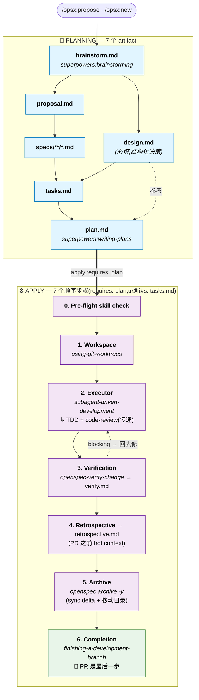

# superpowers-bridge Schema

[English](./README.md) · [简体中文](./README.zh.md)

[](https://github.com/JiangWay/openspec-schemas/actions/workflows/validate-schemas.yml)
[](https://github.com/JiangWay/openspec-schemas/issues?q=is%3Aopen+label%3Aupstream-version-check)
[](#兼容性)
[](#兼容性)

> 把 [OpenSpec](https://github.com/Fission-AI/OpenSpec) 的 artifact 治理流程(**做什么**)与 [obra/superpowers](https://github.com/obra/superpowers) 的运行技能(**如何做**)整合为单一工作流。额外提供 evidence-first 的 `retrospective` artifact,补上 Superpowers 没有的 retro 能力。
>
> 整合**完全发生在 prompt 层**——不修改 Superpowers 任何代码,不修改 OpenSpec CLI。Schema 版本:v1。

---

## 安装

### 方法 1:Claude Code 一键 prompt(推荐)

在你项目的根目录打开 Claude Code,把下面这段粘贴进去:

```
Install the superpowers-bridge schema for OpenSpec into this project:

1. Verify the project has an `openspec/` directory (run `openspec init` if missing).
2. Clone https://github.com/JiangWay/openspec-schemas to a temp dir.
3. Copy the `superpowers-bridge/` subdirectory to `openspec/schemas/superpowers-bridge/`.
4. Run `openspec schema validate superpowers-bridge` to verify.
5. Run `openspec schemas` and confirm `superpowers-bridge` is listed.
6. If a CLAUDE.md exists at the project root, ask me whether to insert the workflow-routing fragment from `openspec/schemas/superpowers-bridge/templates/adopters/CLAUDE.md.fragment.<locale>.md` (auto-detect locale from existing CLAUDE.md content; default zh for Simplified Chinese, no suffix for English). If I say yes, append the fragment as a new section. If no CLAUDE.md exists, skip.
7. Clean up the temp directory.
8. Verify Superpowers plugin is installed by running `claude plugin list`.
   If not listed, run `claude plugin install superpowers@claude-plugins-official`.
9. Show me the final state.
```

### 方法 2:手动 bash(CI / 非 Claude 环境)

```bash
git clone https://github.com/JiangWay/openspec-schemas /tmp/oss
cp -R /tmp/oss/superpowers-bridge ~/your-project/openspec/schemas/superpowers-bridge

# 可选:把 workflow-routing fragment 插入 CLAUDE.md
# cat /tmp/oss/superpowers-bridge/templates/adopters/CLAUDE.md.fragment.md      # 英文
# cat /tmp/oss/superpowers-bridge/templates/adopters/CLAUDE.md.fragment.zh.md  # 简中

rm -rf /tmp/oss
cd ~/your-project
openspec schema validate superpowers-bridge
claude plugin install superpowers@claude-plugins-official  # 若尚未安装
```

---

## 升级已采用本 schema 的项目

如果你的项目早已在 `openspec/schemas/superpowers-bridge/` 安装过本 schema,想拿到最新版本,运行下列其中一种升级方式。升级会整个覆盖 `superpowers-bridge/` 目录,并提供 CLAUDE.md 片段更新 — 详情见下方“升级会【覆盖】什么?”。

### 升级方法 1:Claude Code 一键 prompt(推荐)

在你项目的根目录打开 Claude Code,把下面这段粘贴进去:

```
Upgrade the superpowers-bridge schema in this project:

1. Verify `openspec/schemas/superpowers-bridge/` already exists (upgrade, not fresh install). If missing, abort and tell me to use the install instructions instead.
2. Clone https://github.com/JiangWay/openspec-schemas to a temp dir.
3. Show me the diff between the local `openspec/schemas/superpowers-bridge/` and the cloned `superpowers-bridge/` (use `diff -ruN`). Wait for my 确认 before overwriting.
4. After my 确认, overwrite the local schema dir with the cloned one.
5. Run `openspec schema validate superpowers-bridge` to verify.
6. Check whether this project has `CLAUDE.md` at the repo root.
   - If yes: scan it for an existing workflow-routing section referencing superpowers-bridge.
     - If found: show me the diff between that section and `superpowers-bridge/templates/adopters/CLAUDE.md.fragment.<locale>.md`. Wait for my 确认 before replacing.
     - If not found: ask whether to insert the new fragment from `templates/adopters/CLAUDE.md.fragment.<locale>.md`.
   - If no CLAUDE.md exists: skip.
7. Clean up the temp directory.
8. Show me the final state.
```

> `<locale>` 默认 `zh`(若你 CLAUDE.md 是简中)或省略(英文)。Claude 会依你 CLAUDE.md 的已有语言判断。

### 升级方法 2:手动 bash

```bash
# 1. 获取最新的 bundle
git clone https://github.com/JiangWay/openspec-schemas /tmp/oss-upgrade

# 2. 先看差异(不直接覆盖)
diff -ruN ~/your-project/openspec/schemas/superpowers-bridge /tmp/oss-upgrade/superpowers-bridge

# 3. 确认 diff 后再覆盖
rm -rf ~/your-project/openspec/schemas/superpowers-bridge
cp -R /tmp/oss-upgrade/superpowers-bridge ~/your-project/openspec/schemas/superpowers-bridge

# 4. 验证
cd ~/your-project && openspec schema validate superpowers-bridge

# 5. CLAUDE.md fragment(手动处理)
# 看 /tmp/oss-upgrade/superpowers-bridge/templates/adopters/CLAUDE.md.fragment.zh.md
# 比对自己 CLAUDE.md 是否要插入或更新对应段落

# 6. 清理
rm -rf /tmp/oss-upgrade
```

### 升级会【覆盖】什么?

| 路径 | 行为 | 是否需手动 |
|---|---|---|
| `openspec/schemas/superpowers-bridge/` | 自动整个目录覆盖 — 从 upstream 整体替换(Method 2 是 `rm -rf` + `cp -R`,Method 1 等价) | 不需 |
| `CLAUDE.md`(项目根) | schema 目录附带 `templates/adopters/CLAUDE.md.fragment.<locale>.md` 片段;升级流程会把你的 CLAUDE.md 跟此片段 diff 给你看,等你 确认 才插入或更新 | 需要 — 确认 diff,选择插入 / 取代 / 保留现有 |

> bridge 目录是 整体式 — 要么整体替换版,要么留旧版,**没有逐文件 选择性加入**。CLAUDE.md 是升级流程唯一会涉及项目根目录的文件,而且永远等你 确认。

> In-flight change(任一 phase:brainstorm / design / specs / ...)仍合法 — schema graph(`requires:` edges、PRECHECKs、artifact 依赖)在 v1.x 没有变动。升级前生成的 `verify.md` / `retrospective.md` 仍然可用;若对它们重新运行 `/opsx:verify` 或 `/opsx:continue → retrospective`,会用新 template 结构覆盖。

> 未来若 schema graph 结构性变动(增删 artifact、改 `requires:` edges、PRECHECK 变动),会在 README 上方加版本字段 + 提供 migration guide;v1 → v1.x 纯 instruction prose 改动安全,不需 migration。

---

## 这个 schema 解决什么问题?

OpenSpec 管 **“做什么”**(artifact 生命周期:proposal / specs / tasks / verify 等)。Superpowers 管 **“如何做”**(运行纪律:brainstorming、writing-plans、TDD、code review)。各自坚实,但实际开发中交替使用会出现三个结构性问题:

1. **生成重复** — brainstorming 写设计到 `docs/superpowers/specs/`,OpenSpec 又在 change 目录重写 `proposal.md` / `design.md`,内容高度重叠。
2. **Task 分裂** — OpenSpec 的 `tasks.md`(粗粒度 checkbox)和 Superpowers 的 `plan.md`(TDD micro-step)描述同一件事,但格式、位置、跟踪各自独立。
3. **手动编排** — 用户要自己判断现在该用哪个 skill,两个系统不会自己衔接。

### 为什么用自定义 schema 而非修改现有 skill?

两个替代方案被排除:

- **在 `config.yaml` 加自定义字段**(例如 `skill_bindings`):OpenSpec CLI 不认识这些字段,没有验证、没有发现性,且需要修改多个 SKILL.md 才能读取。
- **直接修改 opsx skill 文件**:侵入性高(影响每个 change),且 SKILL.md 升级时会被覆盖。

自定义 schema 用的是 OpenSpec **原生支持的项目级 schema 机制**:CLI 验证结构、`openspec schemas` 自动列出、每个 change 独立选择 schema(`--schema spec-driven` 或 `--schema superpowers-bridge`)、不修改任何现有 SKILL.md 或 command 文件。

---

## 进入与离开的判断(Entry & exit gates)

本 schema 的 instruction 只在 `/opsx:*` 指令启动 artifact 时才注入 prompt。如果你以 narrative 方式触发 Superpowers skill(例如直接对 Claude 说“我们讨论一下架构”),默认行为会绕过本 schema —— brainstorming 仍会写到 `docs/superpowers/specs/`,让整合的 redirection 完全失效。

这一段告诉你三件事:

1. 何时根本不需要进入本 schema(直接 PR 即可)
2. 已经在 verbal brainstorm,何时该升级成 opsx change
3. 进入本 schema 时要避开的 front-door 反模式

### 何时不进入本 schema(直接 PR)

并非每个改动都要按 change 流程走。下列情境**不需要**建 change:

| 情境 | 是否要建 change | 如何做 |
|---|---|---|
| 新功能 / 新 capability | ✅ 要 | `/opsx:new <name> --schema superpowers-bridge` |
| Breaking change | ✅ 要 | 同上 |
| 架构变更 | ✅ 要 | 同上 |
| Bug fix(恢复原本行为,不变更合约) | ❌ 不要 | 直接 PR |
| 测试补写 / 覆盖率 | ❌ 不要 | 直接 PR |
| 构建工具微调(linter 规则、覆盖率门槛等) | ❌ 不要 | 直接 PR |
| 非破坏性依赖升级 | ❌ 不要 | 直接 PR |
| 文件更新 / typo 修正 | ❌ 不要 | 直接 PR |
| Config 值微调(不动结构) | ❌ 不要 | 直接 PR |

> 原则:**流程仪式跟风险成正比**。动到对外合约、跨系统对接、DB schema、合规边界 → 按 change 流程走;改 typo、抓 bug、调 timeout 数字 → 直接 PR。模糊地带用下方 5 条 checklist 自我检验。

### 进行中的 verbal brainstorm 何时升级成 change

如果用户以 narrative(“我们来讨论架构”“头脑风暴一下”)触发了 `superpowers:brainstorming`,brainstorming 的生成**不可以**写到 `docs/superpowers/specs/` —— 那会绕过本 schema 的 output redirection,在 repo 里留下 orphan artifact。

正确流程:在以下 5 条判断标准**全部满足**之前,维持 verbal brainstorm;全满足时升级到 `/opsx:propose` 或 `/opsx:new`,让 brainstorming 的对话结论落到 `openspec/changes/<name>/brainstorm.md`。

1. **Scope 锁定** —— 一句话讲清“包含什么、不包含什么”,且不会在每一轮对话又长出新项目
2. **主要设计分歧已收敛** —— 替代方案讨论过、选了一个;剩下的 unknown 是**明确列出的 TBD**(有 owner、有影响面),不是“还没想到”
3. **跨系统依赖盘点过** —— 对方就绪 / 暂 mock 替代 / 真未知,三选一说清楚
4. **验收条件可陈述** —— 能列出“这个 change 做完的判断标准”(例:`./mvnw clean verify` 通过 + N 个具体成果)
5. **对话进入收敛** —— 最近 1-2 轮没有“啊还有另一种做法是...”这种 fork

任一条缺 → 继续 brainstorm。全满足 →:
- LLM **应主动建议** “看起来条件齐了,要不要开 `/opsx:propose`?”
- 用户**也可主动讲** “把这个开成 change 吧”
- 不论谁先提,**升级都需人类 确认**,不会自动触发

### Front-door 反模式

| 反模式 | 为什么错 |
|---|---|
| schema 已安装后仍让 brainstorming 写到 `docs/superpowers/specs/` | 绕过 [schema.yaml](./schema.yaml) line 35-39 的 redirection,留下 orphan artifact |
| 让 writing-plans 写到 `docs/superpowers/plans/` | 同理(schema.yaml line 169-171) |
| TBD 还没收敛就升级到 opsx | 那些 TBD 在 apply phase 一样会挡住进度,只是把问题往后挪 |
| 对 bug fix / typo 也建 change | 流程仪式 > 实质风险,反而拖慢交付 |

---

## 工作流与整合点

### Artifact DAG

```text
brainstorm ──┬──→ proposal ──→ specs ──┐
             │                         ├──→ tasks ──→ plan ──→ [apply] ──→ verify ──→ retrospective
             └──→ design ──────────────┘
```

与 `spec-driven` 的差异:

| | spec-driven | superpowers-bridge |
|---|---|---|
| 起点 | proposal(手动撰写) | **brainstorm**(调用 brainstorming skill) |
| Plan 层级 | tasks(粗粒度) | tasks + **plan**(TDD micro-step) |
| apply 需要 | tasks | **plan** |
| apply 方式 | 标准 task-by-task | **worktree + subagent-driven-development**(含 TDD + code-review 传递) |
| Post-apply | (无) | **verify** + **retrospective** artifacts |
| 新增 artifacts | — | brainstorm, plan, verify, retrospective |

### Lifecycle(apply 编排 + 时序注记)

上方 Artifact DAG 显示**文件存在**依赖。下面这张完整 lifecycle 加上 apply phase 的顺序步骤,以及 graph 边与实际生成时序的**错位**。



ASCII 简图(CLI 可读):

```text
PLANNING ━━━━━━━━━━━━━━━━━━━━━━━━━━━━━━━━━━━━━━━━━━━━━━━━━━━━━━
  brainstorm.md ──┬─→ proposal.md ──→ specs/**/*.md ──┐
                  │                                   ├─→ tasks.md ──→ plan.md
                  └─→ design.md(必填)────────────────┘
                                                                       │
                          apply.requires: [plan], apply.tr确认s: tasks  ▼
APPLY ━━━━━━━━━━━━━━━━━━━━━━━━━━━━━━━━━━━━━━━━━━━━━━━━━━━━━━━━
  0. Pre-flight skill check
  1. superpowers:using-git-worktrees
  2. superpowers:subagent-driven-development(+ TDD + code-review 传递)
  3. openspec-verify-change → verify.md ◄┐
                              │           │ blocking → 回去修
                              ▼           │
  4. retrospective.md(PR 之前;hot context)
  5. openspec archive -y(sync delta + 移动目录)
  6. superpowers:finishing-a-development-branch(🏁 PR 是最后一步)
```

> **时序注记**(完整理由见下方“设计触点 #6”):
> - `verify.md` 在 graph 上声明 `requires: plan`,但实际产在 apply step 3 内。
> - `retrospective.md` 声明 `requires: verify`,并依 Step 4 在 PR 开启**之前**生成 —— PR diff 才会包含完整 archived cycle(所有 artifact 完成、spec 已 sync、change folder 在 `archive/`)。
> - `requires:` 边是给 OpenSpec graph 引擎用的“文件存在”依赖;runtime 顺序由 instruction prose 控制。

### 七个 Superpowers 触点

| # | Superpowers skill | 挂在哪 | 触发方式 |
|---|---|---|---|
| 1 | `superpowers:brainstorming` | `brainstorm` artifact instruction | 直接(含 PRECHECK) |
| 2 | `superpowers:writing-plans` | `plan` artifact instruction | 直接(含 PRECHECK) |
| 3 | `superpowers:using-git-worktrees` | apply step 1 | 直接 |
| 4 | `superpowers:subagent-driven-development` | apply step 2 | 直接 |
| 5 | `superpowers:test-driven-development` | (#4 内部触发) | **传递** |
| 6 | `superpowers:requesting-code-review` | (#4 内部触发) | **传递** |
| 7 | `superpowers:finishing-a-development-branch` | apply step 4 | 直接 |

加上一个 OpenSpec built-in:`openspec-verify-change`(apply step 3,生成 `verify.md`)。

> **不支持 `executing-plans` fallb确认**。本 schema 是 opinionated 的:要求 subagent-capable 平台(Claude Code、Codex 等)。替代 executor `superpowers:executing-plans` 并**不会** transitively 触发 TDD 或 code-review(已对 [SKILL.md](https://github.com/obra/superpowers/blob/main/skills/executing-plans/SKILL.md) 做事实查核 —— body 完全没提到 TDD 或 code-review,Integration 段也未列出 `test-driven-development` 与 `requesting-code-review`)。退到 2b 等于静默降级 Superpowers 的核心价值。若你的平台没有 subagent 支持,改用 OpenSpec 内建的 `spec-driven` schema。

### Output redirection(生成重导)

Superpowers skill 有默认输出路径(例如 brainstorming 写到 `docs/superpowers/specs/`)。本 schema 的 artifact instruction **覆盖**这个行为,透过 prompt 上下文注入,把生成重导到 change 目录:

- brainstorming → `openspec/changes/<name>/brainstorm.md`
- writing-plans → `openspec/changes/<name>/plan.md`

纯粹透过 invocation-time 上下文注入实现,不修改 skill 源码。

---

## 使用方式

### 快速流程(推荐)
```bash
/opsx:ff my-feature    # 一条龙:scaffold + brainstorm + proposal + design + specs + tasks + plan
/opsx:apply            # worktree + subagent-driven-development(含 TDD + code-review)
/opsx:verify           # 生成 verify.md(7 项检查)
/opsx:continue         # → retrospective(生成 retrospective.md,§0 + 6 sections)
/opsx:archive          # 归档
```

### 逐步流程
```bash
/opsx:new my-feature --schema superpowers-bridge
/opsx:continue         # → brainstorm(互动式对话)
/opsx:continue         # → proposal
/opsx:continue         # → design(将 brainstorm 重组为结构化决策)
/opsx:continue         # → specs
/opsx:continue         # → tasks
/opsx:continue         # → plan
/opsx:apply            # → 实现 + worktree + subagent-driven-development
/opsx:verify           # → verify.md(post-apply,跑 7 项检查)
/opsx:continue         # → retrospective.md(post-verify,evidence-first §0 + 6 sections)
/opsx:archive
```

### 切回 spec-driven
```bash
# 单一 change 用不同 schema
/opsx:new my-simple-fix --schema spec-driven

# 或修改项目默认(openspec/config.yaml: schema: spec-driven)
```

---

## Apply phase 详细步骤

`/opsx:apply` 会触发 [schema.yaml](./schema.yaml) `apply.instruction` 中的步骤:

#### 0. Pre-flight — 验证必要的 Superpowers skill

确认以下 skill 都安装才继续:

- `superpowers:using-git-worktrees`
- `superpowers:subagent-driven-development`(传递依赖:`test-driven-development`、`requesting-code-review`)
- `superpowers:finishing-a-development-branch`

skill 缺失 → STOP 并通知用户,不静默 fallb确认,本 schema 内也没有 manual mode。建议用户在那个 change 改用 OpenSpec 内建的 `spec-driven` schema,或安装缺失的 skill 后重来。

> 本 schema 的 v0 版本曾在这里放“自动 commit change artifacts 到当前分支”逻辑,在 [PR #970 review](https://github.com/Fission-AI/OpenSpec/pull/970) 后移除:处理未跟踪的 change 目录是 worktree skill 的责任,schema 不该主动改写用户的 git history。

#### 1. Workspace — `superpowers:using-git-worktrees`

建立 `.worktrees/<change-name>/`、切到新 branch、跑项目 setup、确认 test baseline 干净。

#### 2. Executor — `superpowers:subagent-driven-development`

Main agent 读 `plan.md`,为每个 micro-task 派发 fresh subagent。每个 subagent 自动传递:

- **TDD**(`superpowers:test-driven-development`):先写失败测试 → 看着它 fail → 写最小代码 → pass;production code 写在没测试之前会被删掉重来
- **per-task code review**(`superpowers:requesting-code-review`):spec compliance review + code quality review;Critical 级问题挡下进度

完成 coarse task 就更新 `tasks.md` checkbox。所有 task 执行完后,对整个 implementation 再做一次 final code review。

本 schema **不支持** `superpowers:executing-plans` 作为 fallb确认。理由见下方“六个值得记住的设计触点”段。

#### 3. Verification — `openspec-verify-change`

生成 `verify.md`,跑 7 项检查:结构验证(`openspec validate --all --json`)、task 完成度、delta-spec sync 状态、design/specs 一致性(non-blocking warning)、实现信号(commit 状态)、front-door routing leak detector(non-blocking warning)、以及 deferred-dogfood vs automated-test 等价性。最后一项仅在 `plan.md` 有 `[~]` 但等价性章节空白(gap 分析被跳过)时才 block,其他情境属 informational。

失败会回到对应 artifact 修正后重新运行 verify。

> **Steps 4–6 是 verify 后的 canonical 顺序:retro → archive → PR。顺序颠倒会生成不完整的 PR(retrospective 跟 archive 变成 merge 后才补的 trailing commits,失去 hot context)。**

#### 4. Retrospective — `retrospective` artifact(建议,依 Entry & exit gates 的 skip 规则 trivial fix 可跳)

Evidence-first 反思:§0 Evidence(量化前置数据 —— commit 数、diff 大小、tasks done 比例、新依赖、validate 状态等)加上 6 段分析(Wins / Misses / Plan deviations / Skill compliance / Surprises / Promote candidates)。每个 claim 引用 commit / file / 可量化事实,通常指向 §0 而非每行 inline 证据。procedure 直接内嵌在 artifact instruction —— 不依赖外部 skill(Decision 3 in 设计 spec:Claude Code plugin 化延后到 v1.x)。

在开 PR **之前**写好,让 retro 跟其他 artifact 一起落在同一个 PR diff。

#### 5. Archive — `openspec archive -y`(或 `/opsx:archive`)

把 delta spec sync 到 `openspec/specs/<capability>/spec.md`、把 change 目录移动到 `openspec/changes/archive/YYYY-MM-DD-<name>/`。在开 PR **之前**执行完,这样 PR diff 反映完整的 archived cycle 状态(所有 artifact 完成、spec 已 sync、folder 在 `archive/`)。

#### 6. Completion — `superpowers:finishing-a-development-branch`

确认 tests 全部通过、呈现 merge / PR / keep-branch / discard 选项、清理 worktree。**PR 是最后一步** —— 若 retro 或 archive 还没跑,先补完。

---

## CLI cheat sheet

| 情境 | 指令 |
|---|---|
| 首次 clone 项目后 | `bash scripts/install-git-hooks.sh` |
| 新 change(互动式) | `/opsx:new <name> --schema superpowers-bridge` 接着多次 `/opsx:continue` |
| 新 change(一键) | `/opsx:ff <name>` |
| 恢复中断的 change | `/opsx:continue <name>` |
| 进入实现 | `/opsx:apply <name>` |
| 手动 verify | `/opsx:verify <name>` |
| 归档 | `/opsx:archive <name>` |
| 用内建(跳过 brainstorm) | `/opsx:new <name> --schema spec-driven` |
| 列出所有 schema | `openspec schemas` |
| 查看某 change 进度 | `openspec status --change <name> --json` |
| 列出 active changes | `openspec list` |
| 全项目验证 | `openspec validate --all --json` |

---

## 六个值得记住的设计触点

### 1. Skill-name PRECHECK(Layer 1 capability detection)

每个 invoke Superpowers skill 的 artifact / apply step 在 instruction 开头跑 PRECHECK,确认 skill 真的存在于 LLM 的 available skills list。**缺失就 STOP,不静默 fallb确认**。这是 [PR #970 review](https://github.com/Fission-AI/OpenSpec/pull/970) 顾虑 #1 第 1 层的具体应对 —— 明确失败, fail early。

### 2. Schema-level vs prompt-level 整合

整合**完全**发生在 `instruction:` 字段(纯 prompt)。Superpowers 升级某个 skill 的行为时,本 schema 不用改。只有 skill 被改名或移除时才要 touch `schema.yaml`。

### 3. 传递依赖显式化

TDD 与 code-review 平常藏在 `subagent-driven-development` 的 SKILL.md 里。本 schema apply step 2a 的 instruction **直接列出**这两个 transitive activation,让读者一眼看懂“apply 阶段到底会发生什么”。

### 4. Opinionated:只支持 subagent 平台,没有手动 fallb确认

本 schema 要求 subagent-capable 平台(Claude Code、Codex 等)。替代 executor `superpowers:executing-plans` **不会** transitively 触发 TDD 或 code-review(已对其 [SKILL.md](https://github.com/obra/superpowers/blob/main/skills/executing-plans/SKILL.md) 做事实查核 —— body 完全没提及这两者,Integration 段也未列出 `test-driven-development` 与 `requesting-code-review`)。退到 2b 等于静默丢掉 Superpowers 带给整合的核心价值。我们选择在 Step 0 明确失败,并指引用户改用内建的 `spec-driven` schema。

### 5. Evidence-based PRECHECK for verify and retrospective(Layer 2 capability detection)

时序敏感的 artifact 在 instruction 开头跑具体 shell 证据检查:

- **verify**:`git log <base>..HEAD | wc -l > 0` 且 `grep -c '^- \[x\]' tasks.md > 0`
- **retrospective**:`test -f verify.md` 且 `! grep -q '^- \[x\] ❌ FAIL' verify.md`

LLM 不必解读 timing 文本 —— 跑指令、看结果即可。这是顾虑 #1 第 2 层,以及顾虑 #2 的缓解。

### 6. verify 与 retrospective 是时序错位的 artifact(已知限制)

`verify.requires: [plan]` 与 `retrospective.requires: [verify]` 在 schema graph 上是“文件存在”依赖,但两者的 instruction 都明写“MUST run AFTER apply phase / verify pass”。这是刻意错位 —— OpenSpec 引擎只看前置 artifact 文件存在,不会检查 apply 是否真的执行完、verify 是否真的 pass。引擎原生的修法等 OpenSpec 引入 `post_apply` phase(对应 spec-kit 的 `after_implement` hook);上述第 5 点 evidence-based PRECHECK 是 v1 的缓解。

---

## 版本识别

本 bundle 带**两组版本号**,意义不同,不要混淆:

| 标识 | 位置 | 含义 | 范例 |
|---|---|---|---|
| Schema major | `schema.yaml: version: 1` | schema graph 契约版本(artifacts、`requires:` 边、PRECHECK 形状)。破坏性改动才 bump | `1` |
| Bundle release | `VERSION` 档 + git tag | 此 bundle 的 SemVer 发布版本,从属于某个 schema major | `1.0.0`(tag `v1.0.0`) |

`1.x.y` 是 schema major `v1` 的一个 published cut;未来 schema major `v2` 会把 bundle release 重新从 `2.0.0` 起算。Adopter 钉到 `v1.x.y` 即享有 schema graph 在 v1 major 内的相容保证。

> 下方相容矩阵以 `v1`(schema major)为列键,因为 OpenSpec / Superpowers 的兼容性由 schema 契约决定,不受 bundle 内部 patch 影响。

## 兼容性

本 schema 撰写时所对齐的 upstream 基准版本。这是**历史快照,不是端对端兼容性承诺** — CI 无法在 headless 环境执行完整的 prompt-layer workflow,行为兼容性依赖 drift 触发人类检核。

目前 bundle release: **`1.0.0`**(git tag `v1.0.0`;见 [VERSION](./VERSION))。

| superpowers-bridge | OpenSpec CLI | Superpowers plugin | 基准日期 |
|---|---|---|---|
| v1 | `1.3.1` | `v5.1.0` | 2026-05-11 |

### 验证机制

契约分三层 — **基准声明 + 自动 drift 侦测 + 人类检核** — 不是自动兼容性 enforcement。

| 层级 | 机制 | 抓什么 | 触发时机 |
|---|---|---|---|
| 结构性 | [`validate-schemas.yml`](../.github/workflows/validate-schemas.yml) 每次 push/PR;[`version-check.yml`](../.github/workflows/version-check.yml) 每周对 latest OpenSpec 跑 | schema graph 结构性破坏(字段改名、`requires:` 边移除、PRECHECK 语法变动) | CI run 变红 |
| Drift 通知 | [`version-check.yml`](../.github/workflows/version-check.yml) 每周,把基准 vs 最新 npm / GitHub release 字串比对 | Pinned ≠ latest upstream | 开 / 更新 [labelled drift issue](https://github.com/JiangWay/openspec-schemas/issues?q=is%3Aopen+label%3Aupstream-version-check),由人类检核(workflow 维持绿 — drift 是正常状态,不是错误) |
| 端对端 workflow | **未自动化** | Superpowers skill 内部行为改变(改名、改写 prose 影响 PRECHECK 语意、传递依赖变动);OpenSpec 引擎语意微调 | drift issue 触发时,人类读 upstream release notes |

“基准日期”由 maintainer 手动重执行完整 cycle 确认没退步后才推进。在那之前,日期代表的是人类声明,不是自动测试通过。

### Known breaking changes

目前尚无。未来 schema graph 结构性变动(artifact 增删、`requires:` edge 变动、PRECHECK 变动)会记录在这里并附带 migration note。

用户:版本 pin 在表中之上即可。要查自己项目的 runtime 现状,跑 `openspec list` + `openspec schemas` + `claude plugin list`。

---

## 一些值得知道的设计决策

### 为什么 brainstorm 是 artifact 而非 hook

Brainstorming 是多轮互动对话,需要用户参与。把它做为第一个 artifact(而非 schema-level hook)有两个好处:

1. **可跳过** — 如果用户已知道要做什么,可以直接写 `brainstorm.md` 而不调用 skill。
2. **可跟踪** — `openspec status` 能显示 brainstorm 是否完成,后续 artifacts 有明确依赖关系。

### 为什么 plan 独立于 tasks

`tasks.md` 是粗粒度 checkbox(“新增 PdfServiceTest”);`plan.md` 是 micro-step(“建测试骨架 → 写 downloadPdf 测试 → 跑 → commit”)。两者粒度与用途不同:

- `tasks.md` → 跟踪整体进度(apply phase 的 `tr确认s` 字段解析 checkbox)
- `plan.md` → 指导 subagent 逐步实现(executor 的输入)

apply 要求 `plan` 而非 `tasks`,因为 executor 需要 micro-step 才能有效工作;`tr确认s: tasks.md` 确保进度仍由粗粒度 checkbox 跟踪。

### 降级策略

若 Superpowers skill 不可用:

- **`brainstorm` / `plan` artifact**:用户可明确 选择性加入 改成手动撰写(PRECHECK 会 STOP 并通知;手动模式需要用户明确选择,不会静默降级)
- **`apply` phase**:本 schema 没有 manual fallb确认。Step 0 PRECHECK 缺任何必要 skill 就 STOP,建议改用 OpenSpec 内建的 `spec-driven` schema 跑那个 change。理由见上面“设计触点 #4”—— `executing-plans` 不会 transitively 触发 TDD 与 code-review,降级的 apply 等于违背 schema 的目的

---

## 相关链接

- [schema.yaml](./schema.yaml) — 机器可读的 schema 定义
- [templates/](./templates/) — 各 artifact 的 markdown 模板
- [README.md](./README.md) — English version
- [obra/superpowers](https://github.com/obra/superpowers) — Superpowers skill 来源
- [Fission-AI/OpenSpec](https://github.com/Fission-AI/OpenSpec) — OpenSpec
- [OpenSpec PR #970](https://github.com/Fission-AI/OpenSpec/pull/970) — 带来这个设计的 review thread
